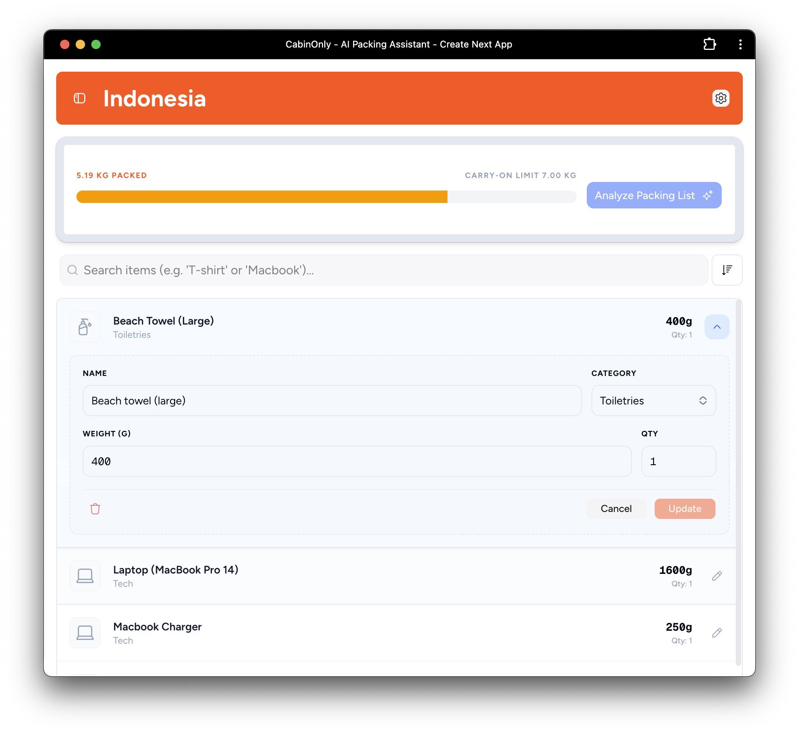

# Aeropack ✈️

A packing list web app focused on weight tracking, item organization, and fast data entry. This repository is a portfolio project built to demonstrate full‑stack app design, UI composition, and data modeling.



## Features

- 🤖 **AI Weight Estimation** - Estimate item weights using Google's Gemini AI
- 📊 **Weight Tracking** - Compare total pack weight against trip limits
- 🎒 **Categories & Icons** - Organize items by category with custom icons
- ⚖️ **Worn Item Toggle** - Exclude worn items from weight calculations
- 🔍 **Searchable Weight Library** - Reusable list of common travel items and weights
- 📱 **Responsive Design** - Works on desktop and mobile

## Tech Stack

### Frontend
- **Next.js 16** - React framework with App Router and Server Actions
- **React 19** - Latest React features with improved server components
- **TypeScript** - Type-safe development
- **Tailwind CSS 4** - Utility-first styling with latest v4 features
- **shadcn/ui** - Beautifully designed, accessible component library
- **TanStack Query** - Powerful async state management

### Backend & Database
- **Neon** - Serverless Postgres database
- **Drizzle ORM** - Type-safe SQL query builder with schema management
- **Drizzle Kit** - Database migrations and introspection

### AI & APIs
- **Vercel AI SDK** - Interface for AI model interactions
- **Google Gemini Flash** - Model used for weight estimation

### Developer Experience
- **Biome** - Linting and formatting (ESLint + Prettier replacement)
- **Lefthook** - Git hooks for code quality
- **React Hook Form** - Form management with validation

## Run Locally

```bash
pnpm install
pnpm db:push
pnpm dev
```

Set environment variables in `.env.local`:
```env
DATABASE_URL=...
GOOGLE_GENERATIVE_AI_API_KEY=...
```

## Project Structure

```
aeropack/
├── app/              # Next.js App Router pages
├── actions/          # Server Actions for data mutations
├── components/       # React components
│   ├── ui/          # shadcn/ui components
│   └── dashboard/   # Feature-specific components
├── db/              # Database schema and migrations
├── lib/             # Utility functions and configurations
└── utils/           # Helper functions
```

## Database Schema

The app uses three main tables:

- **weight_library** - Global repository of item weights
- **packing_lists** - Trip containers with weight limits
- **list_items** - Individual items within packing lists

See [db/schema.ts](db/schema.ts) for the schema definition.

## Scripts

```bash
pnpm dev              # Start development server
pnpm build            # Build for production
pnpm start            # Start production server
pnpm lint-format      # Run Biome linter and formatter
pnpm db:seed          # Seed database with sample data
```

## Contributing

If you want to suggest improvements, open an issue or PR.

## License

MIT License
